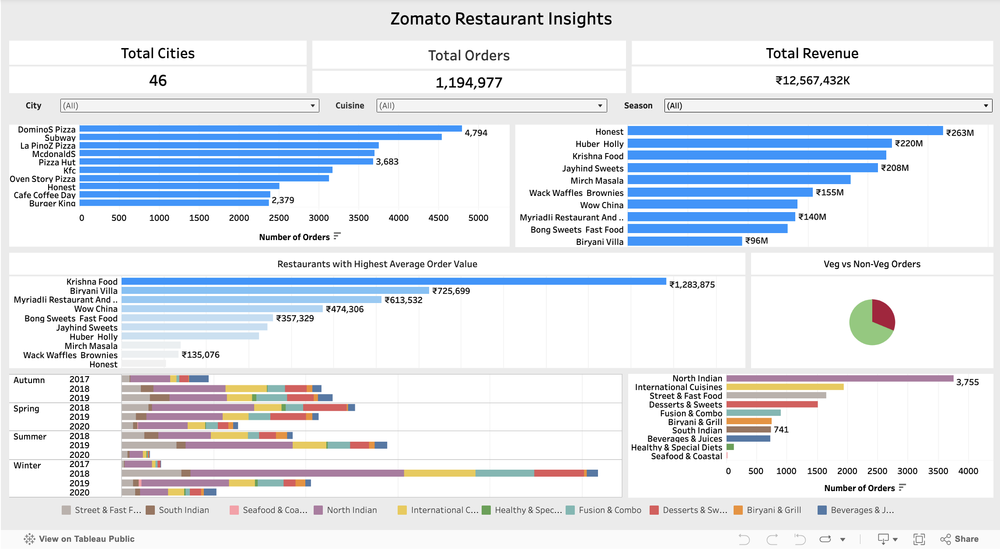

# Zomato Restaurant Insights

**Author:** Khushboo Shikhar  
**Dashboard Link:** [View on Tableau Public](https://public.tableau.com/app/profile/khushboo.shikhar/viz/zomato_restaurant_analysis2/ZomatoRestaurantInsights2)

---

## 📌 Overview
This project analyzes restaurant data from **Zomato** and visualizes key patterns through an interactive Tableau dashboard.  
It provides insights into cuisines, customer ratings, pricing, and geographical distribution of restaurants.  
The goal is to highlight data-driven trends that can support restaurant owners, food delivery platforms, and food enthusiasts.

---

## 🎯 Objectives
- Explore the distribution and popularity of cuisines.  
- Analyze customer **ratings** by price range, location, and restaurant type.  
- Identify **location-based trends** in restaurant ratings and costs.  
- Provide actionable insights for decision-making in the food industry.  

---

## 📂 Data Sources
- Publicly available **Zomato restaurant dataset**.  
- Key attributes include:
  - Restaurant Name & Location  
  - Cuisines Offered  
  - Ratings & Votes  
  - Price/Cost for Two  
  - Service Features (e.g., online delivery availability)  

---

## 📊 Key Insights
- **Cuisine Popularity:** Identifies which cuisines are most common and top-rated.  
- **Price vs Rating:** Analyzes whether higher prices always mean higher ratings.  
- **Location Trends:** Shows which cities or areas have more highly rated restaurants.  
- **Rating Distribution:** Visualizes how restaurants fall into rating categories.  

---

## 🛠️ Tools & Technologies
- **Tableau Public** → Data visualization & dashboard creation  
- **Excel / Python (optional)** → Data cleaning & preprocessing (if used)  

---

## 🚀 How to Use the Dashboard
1. Open the [Tableau dashboard](https://public.tableau.com/app/profile/khushboo.shikhar/viz/zomato_restaurant_analysis2/ZomatoRestaurantInsights2).  
2. Use filters (Cuisine, Location, Price Range) to customize the view.  
3. Hover over data points for detailed insights.  
4. Compare ratings, costs, and cuisine performance interactively.  

---

## 📌 Findings & Conclusions
- Some cuisines consistently receive higher ratings.  
- Affordable restaurants can still achieve top ratings → good **value for money**.  
- Certain cities outperform others in restaurant quality and variety.  
- Customer preferences differ across cuisines and locations.  

---

## ⚠️ Challenges & Limitations
- Missing or incomplete data for some restaurants.  
- Ratings may be biased (extreme experiences reviewed more often).  
- Niche cuisines have fewer samples → less reliable trends.  
- Data may not reflect the most current restaurant landscape.  

---

## 🔮 Future Improvements
- Add **time-series analysis** to track trends over years.  
- Incorporate **sentiment analysis** of customer reviews.  
- Build **geospatial maps** to visualize density and performance.  
- Benchmark insights against competitor platforms and other markets.  

---

📌 *This project is part of my data analytics portfolio showcasing skills in data visualization, storytelling, and business insights.*  
